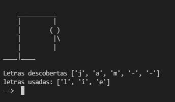

<h1> Jogo da forca feito em python </h1>

<h2>O jogo tem como tema: Frutas </h2>

O Jogo da forca foi dividido em 3 arquivos

<ul>

<li>Arquivo principal (forca.py) </li>
<li>Arquivo com as palavras (palavras.py) </li>
<li>Arquivo com as funções (funcoes.py) </li>

</ul>

 

Tentei comentar ao máximo para melhor entendimento 

 

